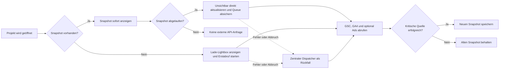

# Datenaktualisierung im DataPeak-Dashboard

Stand: 18. September 2026

Dieses Dokument beschreibt, wie DataPeak die Dashboard-Daten aus Google Search Console (GSC), Google Analytics 4 (GA4), Google Ads, Sitemaps und Google-Unternehmensprofilen aktualisiert. Es trennt dabei bewusst zwischen dauerhaft gespeicherten Dashboard-Snapshots, der URL-Indexierungsprüfung und den bei Bedarf geladenen, ebenfalls gespeicherten Profilvorschauen.

## 1. Grundprinzip: Cache-first mit Stale-While-Revalidate

Ein Projektaufruf soll keine Kette externer Google-API-Anfragen auslösen. Deshalb arbeitet das Dashboard nach folgendem Prinzip:

1. DataPeak liest zuerst den letzten gespeicherten Snapshot aus Neon.
2. Ein vorhandener Snapshot wird sofort angezeigt, auch wenn er bereits zur Aktualisierung fällig ist.
3. Eine fällige Aktualisierung mit vorhandenem Snapshot wird beim Öffnen unsichtbar über `/api/projects/[id]/dashboard-sync` gestartet und zugleich als wiederverwendbarer Auftrag in `project_sync_jobs` abgesichert.
4. Falls der direkte Hintergrundabruf nicht abgeschlossen werden kann, übernimmt der zentrale Dispatcher den Auftrag mit begrenzter Laufzeit und begrenzter Parallelität.
5. Erst nach einem verwertbaren Abruf wird der alte Snapshot ersetzt.
6. Bei Timeout- oder Quotenfehlern bleibt der letzte funktionierende Snapshot erhalten. Ein permanenter Berechtigungsfehler darf einen klar als teilweise abgedeckt markierten Snapshot der weiterhin funktionierenden Quelle nicht einfrieren.

Fehlt ein Snapshot vollständig, startet die Serverantwort bewusst **keinen** langen GSC-/GA4-Abruf. Das Dashboard zeigt die einheitliche Lade-Lightbox; anschließend übernimmt der Browser-Endpunkt den kontrollierten Erstabruf. Der alle zwölf Stunden laufende Cron bleibt als Rückfall bestehen und erkennt zusätzlich fehlende `30d`-Snapshots. Bereits vorhandene Sonderzeiträume werden bei Nutzung nach ihrer TTL erneuert; ein noch nie gespeicherter Sonderzeitraum wird erst beim ausdrücklichen Öffnen dieses Zeitraums angelegt.

Die Superadmin-Aktion **Aktualisierung vormerken** (`/api/clear-cache`, historischer Pfadname) markiert vorhandene Dashboard-Snapshots über `last_fetched` als fällig, löscht ihre Daten aber nicht. Der letzte gültige Stand bleibt während eines Fehlers oder einer wartenden Synchronisierung sichtbar. Die Aktion markiert alle Projekte und Zeiträume, löst aber keine direkte parallele Google-Abfrage aus. Der Dispatcher legt `30d`-Aufträge im nächsten regulären Lauf an; andere Zeiträume werden beim Öffnen eingereiht. Ein bereits physisch gelöschter Snapshot kann dadurch nicht wiederhergestellt werden und benötigt einen erfolgreichen Neuabruf. Fehlt nur der Snapshot des gewählten Zeitraums, bietet die Lightbox bei vorhandenem anderem Zeitraum einen Wechsel zu diesen gespeicherten Daten an und unterscheidet wartende von fehlgeschlagenen Aufträgen.



### Begrenzte Statusabfragen und Laufzeit

Der Browser startet einen Auftrag einmal per POST. Nach HTTP 202 folgen ausschließlich lesende GET-Statusabfragen, höchstens achtmal mit Abständen von 10, 20, 40 und dann 60 Sekunden. In inaktiven Tabs pausieren diese Abfragen. Bei vorgemerkter Wiederholung oder Ablauf des Limits endet das Polling; bei fehlendem Snapshot zeigt die vorhandene Lightbox einen Wartezustand ohne endlosen Fortschrittsbalken. Erneutes Öffnen setzt fehlgeschlagene Jobs nicht zurück. Ihr regulärer Cooldown bleibt Sache des Dispatchers.

Der Datenloader begrenzt Abrufe auf die frühere Grenze aus Dispatcher-Deadline und 220 Sekunden, mit zehn Sekunden Reserve für Abschlussarbeiten. Ein auf den Lauf begrenztes AbortSignal wird an Google-, Bing- und Wetteranfragen weitergegeben. Nach Ablauf werden neue Quellenabrufe und das Schreiben des Dashboard-Snapshots verhindert. Kennzahlen verwenden das beim Abruf gespeicherte reportingPeriod; bei erhaltenen Ads-Berichten gelten deren ursprüngliche Datumsgrenzen und Abrufzeitpunkte.

### Zentraler Dispatcher

Vercel ruft `GET /api/cron/sync-project-data` alle zwölf Stunden um 00:00 und 12:00 UTC auf. Der Endpunkt ist mit `CRON_SECRET` geschützt und verarbeitet drei Arten von Aufträgen:

| Auftrag | Aufgabe |
| --- | --- |
| `dashboard` | Gemeinsamen Dashboard-Snapshot mit GSC-, GA4- und gegebenenfalls Google-Ads-Daten aktualisieren |
| `gsc-history` | Historische GSC-Tageswerte und gespeicherte Landingpage-Werte aktualisieren |
| `indexing` | Sitemap einlesen und ausgewählte URLs mit der URL Inspection API prüfen |

Pro Cronlauf werden maximal neun Aufträge innerhalb eines Zeitbudgets von 235 Sekunden verarbeitet: vier Indexierungs-, drei Dashboard- und zwei GSC-Historienaufträge. Vor jedem Start prüft der Dispatcher, ob das verbleibende Zeitbudget für den jeweiligen Auftragstyp reicht. Nicht passende Typen werden nicht reserviert und verbrauchen deshalb keinen Versuch oder Defer.

Die Auswahl berücksichtigt zuerst, wie viele Aufträge jeder Typ im aktuellen Lauf bereits erhalten hat. Bei Gleichstand zählt die früheste Wartezeit seit dem späteren Zeitpunkt aus ältestem fälligen Auftrag und letztem gespeicherten Start dieses Typs. Dadurch beginnt ein neuer Cronlauf nicht grundsätzlich wieder mit Dashboard, selbst wenn im vorigen Lauf nur ein Auftrag ausgeführt werden konnte. Ein fehlgeschlagener oder verschobener Versuch zählt ebenfalls als erhaltener Zug. Innerhalb eines Typs werden ältere Fälligkeiten zuerst bedient; bei gleichem Termin entscheidet die Priorität. Die benötigten Zeitstempel stammen aus `project_sync_jobs`; es gibt keine zusätzliche Scheduler-Tabelle und keine neue Migration.

Zur Kapazitätsprüfung liefert die Cron-Antwort `queueBefore`, `queueAfter` und `jobTimings` und protokolliert sie unter `[Sync Dispatcher] Kapazitaet`. Enthalten sind fällige Aufträge je Quelle, älteste Fälligkeit, letzter Start und die Laufzeit jedes ausgeführten Auftrags in Millisekunden. Die Queue wird dafür zweimal aggregiert gelesen, nicht laufend gepollt. Wächst der Rückstau über mehrere Läufe oder werden Fälligkeiten dauerhaft älter, reicht die verfügbare Kapazität nicht aus. 48 Stunden sind weiterhin die reguläre Fälligkeit, keine garantierte Fertigstellungsfrist; der Dispatcher bleibt bei zwölf Stunden. Ob dies für alle Projekte ausreicht, muss anhand mehrerer echter Produktionsläufe geprüft werden.

Die Queue-Lease eines reservierten Jobs beträgt 240 Sekunden. Zusätzlich verhindert eine 90 Sekunden lange, alle 25 Sekunden per Heartbeat verlängerte Quellen-Lease, dass mehrere Prozesse gleichzeitig dieselben Google-Daten abrufen; Dashboard-Leases sind nach Zeitraum getrennt, etwa `dashboard:30d`. Verschiebungen verbrauchen keinen Ausführungsversuch, werden aber separat gezählt und nach zwölf Wiederholungen beendet. Kurzlebige Neon-Verbindungsfehler bei Queue-Operationen werden bis zu dreimal direkt wiederholt; bleibt der Fehler bestehen, antwortet der Dispatcher mit HTTP 503.

Google-API-Fehler werden fachlich in `transient`, `quota`, `permanent` und `unknown` eingeteilt. In der Queue werden erneut versuchbare Fehler einschließlich Quotenfehler als `transient` und dauerhafte Konfigurationsfehler als `permanent` gespeichert. Transiente Fehler und Quotenfehler behalten den letzten guten Cache. Dauerhafte Konfigurationsfehler wie 401/403/404 wechseln direkt in einen 24-Stunden-Cooldown; sie machen den Cronlauf nicht dauerhaft rot, werden aber als eingeschränkter Zustand protokolliert. Unbekannte Fehler gelten vorsichtshalber als erneut versuchbar.

## 2. GSC-Daten

### Voraussetzungen

- Beim Projekt ist `gsc_site_url` hinterlegt.
- Der DataPeak-Service-Account besitzt Zugriff auf die zugehörige Search-Console-Property.

### Welche Daten werden geladen?

Der normale Dashboard-Snapshot und die GSC-Historie verwenden dasselbe Berichtsfenster. Es endet zwei Tage vor dem aktuellen Datum, damit verzögert eintreffende Search-Console-Werte nicht als künstlicher Einbruch erscheinen. Der Snapshot enthält unter anderem:

- Klicks, Impressionen, CTR und durchschnittliche Position
- Tagesverlauf für den gewählten Zeitraum
- Top-Suchanfragen
- Suchanfragen je Landingpage
- aktuellen Zeitraum und einen gleich langen Vergleichszeitraum
- Prompt-Tracking-Signale aus geeigneten GSC-Queries
- offizielle Google-GenAI-Daten, soweit Google diese über die API bereitstellt; ein manueller GSC-Export bleibt sonst der Fallback

### Aktualisierungsrhythmus

Der Standardzeitraum `30d` wird automatisch als fällig markiert, sobald sein Snapshot 48 Stunden alt ist. Dieselbe zentrale Cache-Policy steuert sowohl die Anzeige als auch die Einplanung des Hintergrundauftrags:

| Zeitraum | Cache-Dauer |
| --- | ---: |
| 7 Tage | 48 Stunden |
| 30 Tage | 48 Stunden |
| 3 Monate | 48 Stunden |
| 6 Monate | 72 Stunden |
| 12, 18 und 24 Monate | 7 Tage |

Nur der Standardzeitraum `30d` wird regelmäßig vorab synchronisiert und bei fehlendem Cache automatisch vom Dispatcher erzeugt. Andere Zeiträume werden beim ersten Öffnen über den Browser-Endpunkt erzeugt und anschließend entsprechend ihrer Cache-Dauer aktualisiert.

Ein vorhandener, aber abgelaufener Snapshot wird sofort ausgeliefert und im Browser unsichtbar erneuert. Die API reserviert dafür denselben Queue-Auftrag, den sonst der Cron verarbeiten würde; Quellen-Lease und Queue-Lease verhindern Doppelabrufe. Bei einem transienten Fehler bleibt der alte Snapshot sichtbar und der Auftrag für den Dispatcher erhalten. Ein vollständig fehlender Snapshot verwendet denselben Ablauf mit sichtbarer Lade-Lightbox. Ein zentraler Snapshot-Vertrag stellt sicher, dass Schreiben und Lesen dieselbe Versionsnummer verwenden. Änderungen der Dashboard-, Top-Queries- oder Ads-Sheet-Version markieren einen vorhandenen Snapshot einmalig als veraltet; fehlende reine Metadaten lösen allein keinen API-Abruf aus.

### GSC-Historie

Neben dem Dashboard-Snapshot gibt es einen eigenen Historienlauf:

- beim ersten Lauf werden bis zu 90 Tage geladen;
- danach wird inkrementell ein überlappendes Sieben-Tage-Fenster aktualisiert;
- der Zeitraum endet zwei Tage vor dem aktuellen Datum, weil GSC-Daten verzögert eintreffen können;
- aktuelle und vorherige 30-Tage-Werte der gespeicherten Landingpages werden aktualisiert;
- der nächste reguläre Lauf wird nach 48 Stunden geplant, bei einem Fehler weiterhin nach sechs Stunden.

Die Historie liegt getrennt vom Dashboard-Snapshot in `gsc_daily_data`, `landingpages` und `project_data_sync_state`.

### Fehlerverhalten

Bei transienten GSC-Fehlern oder ausgeschöpfter Quote schreibt DataPeak keinen unvollständigen neuen Dashboard-Snapshot. Bei einem permanenten Berechtigungs- oder Konfigurationsfehler kann die weiterhin funktionierende GA4-Quelle als Teil-Snapshot gespeichert werden; die betroffenen Kennzahlen werden über ihre Metadaten als teilweise oder nicht verfügbar ausgewiesen.

## 3. GA4-Daten

### Voraussetzungen

- Beim Projekt ist `ga4_property_id` hinterlegt.
- Die verwendeten Google-Zugangsdaten dürfen auf die Property zugreifen.

### Welche Daten werden geladen?

GA4 liefert unter anderem:

- Sitzungen, Nutzer und neue Nutzer
- Conversions
- Engagement-Rate, Absprungrate und durchschnittliche Sitzungs-/Interaktionsdauer
- bezahlte Zugriffe
- KI-Traffic und KI-Traffic-Details
- Top-Landingpages und Conversion-Werte
- Channel, Land, Stadt und Endgerät
- Stadt- und Landingpage-Signale für die lokale Sichtbarkeit
- optional Google-Ads-Signale als Fallback, wenn kein Ads-Sheet konfiguriert ist

Aktueller Zeitraum und Vergleichszeitraum werden nacheinander geladen. Auch die Dimensionsberichte werden bewusst seriell abgerufen. Das reduziert gleichzeitige GA4-Anfragen und schützt vor Quota- und Concurrent-Request-Fehlern.

### Cache und Aktualisierung

GA4 und GSC werden im selben Dashboard-Snapshot in `google_data_cache` gespeichert. Deshalb gelten für GA4 dieselben Cache-Dauern und dasselbe um zwei Tage verzögerte Berichtsfenster wie für GSC. Dieser bewusste Konsistenz-Trade-off verhindert unterschiedliche Datumsgrenzen innerhalb eines Widgets und vermeidet API-Aufrufe beim Seitenaufruf.

### Fehlerverhalten und Abdeckung

- Scheitert der zentrale GA4-Bericht transient oder wegen einer Quote, wird der bestehende Snapshot nicht überschrieben.
- Ist der GA4-Zugriff dauerhaft entzogen, kann ein Teil-Snapshot mit funktionierenden GSC-Daten gespeichert werden; GA4-Kennzahlen werden nicht als gemessene Nullwerte ausgegeben.
- Scheitert nur ein optionaler Detailbericht, kann der Snapshot mit eingeschränkter Abdeckung gespeichert werden.
- Quelle, Aktualisierungszeit, Zeitraum, Abdeckung und Berechnungsmethode werden zusätzlich in `project_metric_snapshots` dokumentiert.
- GA4-Daten bleiben von Consent, Consent Mode und gegebenenfalls modellierten Werten abhängig. Sie sind deshalb nicht direkt mit cookie-unabhängigen GSC-Impressionen gleichzusetzen.

## 4. Google-Ads-Daten

Google Ads wird innerhalb desselben `dashboard`-Auftrags wie GSC und GA4 geladen und zusammen mit dem Dashboard-Snapshot gespeichert. Es gibt zwei klar priorisierte Datenwege:

1. Ist `google_ads_sheet_id` beim Projekt hinterlegt, liest DataPeak den vom Google-Ads-Script befüllten Google-Sheet-Export für den aktuellen Dashboard-Zeitraum.
2. Ist kein Ads-Sheet konfiguriert, aber GA4 verfügbar, versucht DataPeak Ads-Signale aus GA4 zu laden.

Der Sheet-Weg hat Vorrang und liefert Kampagnen, Anzeigengruppen, Anzeigen, Suchanfragen, Landingpages sowie aggregierte Kennzahlen, soweit die entsprechenden Tabellenblätter und Datumszeilen vorhanden sind. Ein konfiguriertes, aber leeres oder nicht lesbares Sheet wird nicht stillschweigend durch GA4 ersetzt; das Widget erhält stattdessen einen klaren Ads-Fehler beziehungsweise einen leeren konfigurierten Stand. So bleibt sichtbar, dass die vorgesehene Datenquelle nicht funktioniert.

Nicht lesbare Ads-Tabellen lösen einen Abruffehler aus; eine erfolgreich gelesene leere Tabelle bleibt ein gültiger leerer Bericht. Bei einem Fehler übernimmt DataPeak den letzten erfolgreichen Ads-Bericht derselben konfigurierten Quelle und desselben Dashboard-Zeitraums. Zeitraum und Abrufzeitpunkt dieses Berichts bleiben erhalten. Ohne vorherigen Bericht werden keine gemessenen Nullwerte erzeugt.

Google Ads ist eine optionale Detailquelle. Ein Ads-Fehler wird in `apiErrors.googleAds` dokumentiert, blockiert aber keinen ansonsten verwertbaren GSC-/GA4-Snapshot. Ads-Daten verwenden dasselbe Berichtsfenster und dieselbe Cache-Dauer wie der jeweilige Dashboard-Zeitraum. Es gibt keinen separaten Ads-Cron und keinen Google-Ads-Abruf innerhalb des Server-Renderings; bei einem fälligen Snapshot startet danach der gemeinsame unsichtbare Hintergrundabruf.

Der Sheet-Import speichert zusätzlich den tatsächlich angeforderten Berichtszeitraum und das jüngste in den Kampagnenzeilen vorhandene Datum. Das Widget zeigt deshalb `Sheet-Daten bis ...`, wenn der Export hinter dem Berichtsende liegt. Eine im `_meta`-Tab eingetragene Ausführungszeit ersetzt nicht das Datum der letzten echten Datenzeile.

## 5. Sitemap und Indexierungsstatus

Die Sitemap-Synchronisierung ist ein eigener Prozess. Sie ist nicht Teil des gemeinsamen GSC-/GA4-Snapshots.

### Sitemap-Erkennung

DataPeak prüft je Projekt:

1. eine explizit konfigurierte Sitemap;
2. Sitemap-Einträge aus `robots.txt`;
3. typische WordPress- und Standardpfade wie `/wp-sitemap.xml`, `/sitemap_index.xml` und `/sitemap.xml`.

Sitemap-Indizes werden rekursiv bis zu einer begrenzten Tiefe aufgelöst. Insgesamt werden maximal 5.000 URLs übernommen. URLs außerhalb der konfigurierten GSC-Property sowie technische URLs wie Feeds, Kommentar-Feeds, Trackbacks, `xmlrpc` und `wp-json` werden herausgefiltert.

### Was wird gespeichert?

| Tabelle | Inhalt |
| --- | --- |
| `project_indexing_sync` | Status und Zeitpunkt des Projektlaufs sowie nächster geplanter Lauf |
| `project_indexing_urls` | Sitemap-URL, Last-Modified-Signal, letzter bekannter Google-Status und nächster Prüftermin |
| `project_metric_snapshots` | Aggregierte Kennzahlen und Metadaten für das Widget |
| `url_inspection_budget` | Reserviertes URL-Inspection-Tageskontingent je GSC-Property |

Der letzte bekannte Google-Indexierungsstatus bleibt erhalten, während eine neue URL-Inspection noch aussteht. Ein massenhaft geändertes `lastmod` wird als mögliches Sitemap-Rauschen behandelt und führt nicht automatisch dazu, dass alle URLs gleichzeitig erneut geprüft werden. Neue und glaubhaft geänderte URLs werden bevorzugt.

### Automatische Prüfung

Der Dispatcher reserviert pro Indexierungsauftrag maximal 150 Kandidaten und gibt dem Auftrag höchstens etwa 90 Sekunden. Reicht eine Charge nicht aus, wird die Restmenge beim nächsten geeigneten 12-Stunden-Dispatcherlauf automatisch fortgesetzt. Der Benutzer muss nicht wiederholt auf **Jetzt prüfen** klicken.

Die URL Inspection API wird zusätzlich durch `url_inspection_budget` koordiniert. DataPeak reserviert höchstens 1.800 Abfragen pro UTC-Tag und GSC-Property und lässt damit einen Sicherheitspuffer. Parallele Worker sperren den Budgetdatensatz transaktional, sodass sie das Tageslimit nicht gemeinsam überschreiten können. Nicht gestartete Reservierungen werden zurückgegeben. Ist das Budget ausgeschöpft, pausiert der Projektlauf für mindestens eine Stunde; die URLs bleiben unverändert und werden nicht fälschlich als fehlerhaft markiert.

Das Widget unterscheidet dabei zwei Zustände:

- **Vorläufiger Datenstand:** Mindestens eine relevante Sitemap-URL hat noch kein erfolgreich klassifizierbares Inspection-Ergebnis. Indexiert-/Nicht-indexiert-Summen werden ausdrücklich als vorläufig ausgewiesen und die Erstabdeckung wird separat angezeigt.
- **Vollständiger Datenstand:** Jede relevante Sitemap-URL wurde mindestens einmal erfolgreich als indexiert oder nicht indexiert klassifiziert. Spätere zyklische Nachprüfungen ändern daran nichts; bis zum neuen Ergebnis bleibt der letzte gültige Status sichtbar.

Die ungefähren Wiederholungsintervalle sind:

| URL-Zustand | Nächste URL Inspection |
| --- | ---: |
| Indexiert und mindestens 100 GSC-Impressionen | nach 7 Tagen |
| Indexiert mit geringerer Leistung | nach 30 Tagen |
| Nicht indexiert | nach 7 Tagen |
| Noch nicht eindeutig geprüft | nach 24 Stunden |
| Transienter Fehler | abgestuft nach ca. 2, 12 oder 48 Stunden |
| Permanenter URL-spezifischer Fehler | nach 7 Tagen |

Ein projektweiter 401/403-Berechtigungsfehler beendet die Charge sofort, ohne die betroffenen URLs als fehlerhaft zu markieren. Der Queue-Auftrag wechselt stattdessen in den 24-Stunden-Cooldown für permanente Konfigurationsfehler.

Ein vollständig abgeschlossener Projektlauf wird normalerweise nach 48 Stunden wieder fällig. Sofort fällige Restarbeit wird innerhalb des nächsten Dispatcher-Zyklus fortgesetzt. Liefert Google für eine URL einen temporären Fehler, wird diese URL zu ihrem abgestuften Retry-Termin erneut eingeplant, ohne den übrigen Bestand als vollständig auszugeben.

### Manuelle Prüfung

**Jetzt prüfen** reiht einen priorisierten Indexierungsauftrag ein und versucht, ihn unmittelbar im selben API-Aufruf zu übernehmen. Der manuelle Lauf hat eine Deadline von 50 Sekunden, reserviert 8 Sekunden für Abschlussarbeiten, nutzt höchstens sechs parallele Inspection-Aufrufe und reserviert maximal 120 aktuell fällige URLs. Wegen Antwortzeit, Sitemap-Lesen, Google-Latenz oder Tagesbudget kann die tatsächlich geprüfte Zahl niedriger sein. Kann ein bereits laufender Auftrag nicht übernommen werden, antwortet die Route mit HTTP 202 und das Widget beobachtet dessen Fortschritt weiter.

Der sichtbare Zähler unterscheidet die Kandidaten der aktuellen Charge von der gesamten zu Beginn fälligen Menge. Verbleibende URLs werden anschließend automatisch vom Dispatcher weiterbearbeitet. Der Button setzt bewusst nicht alle bereits aktuell geprüften URLs wieder auf fällig.

### Warum können DataPeak und der GSC-Bericht abweichen?

Der GSC-Seitenbericht und die URL Inspection API sind unterschiedliche Google-Systeme und können zu verschiedenen Zeitpunkten aktualisiert werden. DataPeak zeigt den zuletzt erfolgreich geprüften URL-Status und nicht einfach die Summe aus einem exportierten GSC-Coverage-Bericht. Eine zeitweilige Differenz ist deshalb möglich und wird erst mit den nächsten URL-Inspections aufgelöst.

## 6. Google-Unternehmensprofile

### Wichtige Abgrenzung

DataPeak verwendet für die Vorschau aktuell die **Google Places API**, nicht die Google Business Profile API. Es werden daher öffentliche Profildaten angezeigt, aber keine internen Unternehmensprofil-Statistiken wie Anrufe, Routenanfragen, Nachrichten oder Beitragsleistung synchronisiert.

### Konfiguration

Die Standortkonfiguration liegt beim Projekt in `users.project_locations` und kann enthalten:

- Standortname, PLZ, Stadt und Land
- Google Place ID
- Google-Maps-/Unternehmensprofil-URL
- optionale manuelle Bild-URL
- Standort-Landingpages und Keyword-Aliase für Local SEO

### Wann werden Profildaten aktualisiert?

Unternehmensprofil-Vorschauen laufen nicht über den zentralen Cron:

1. Das Local-SEO-Widget wird angezeigt.
2. Für konfigurierte Standorte ruft der Browser `/api/google-places/preview` auf.
3. Der Server verwendet bevorzugt die Place ID; ohne verwertbare ID sucht er nach Standortname, Stadt und PLZ.
4. Zuerst wird die aktuelle Places API verwendet, bei Bedarf der Legacy-Fallback.
5. Ein erfolgreicher Stand wird projekt- und standortbezogen in Neon gespeichert und danach im Widget dargestellt.

Geladen werden insbesondere Name, Adresse, Kategorie, Bewertung, Anzahl der Bewertungen, Geschäftsstatus, aktuelle Öffnung und das erste Profilfoto.

### Cache-Verhalten

- DataPeak liest zuerst `google_place_preview_cache`. Ein bis zu 48 Stunden alter Stand wird ohne neuen Google-Abruf verwendet.
- Nach Ablauf der 48 Stunden wird das Profil beim nächsten Anzeigen erneut über Google Places geladen.
- Die Browserantwort ist eine Stunde frisch und darf bis zu 48 Stunden im Hintergrund erneuert werden (`stale-while-revalidate`).
- Profilfotos verwenden dieselbe 24-Stunden-Revalidierung.
- Eine geänderte Place ID oder Standortsuche erzeugt beim nächsten Anzeigen einen neuen Cache-Schlüssel.
- Scheitert der Google-Abruf, bleibt der letzte erfolgreiche Profilstand sichtbar und wird intern als veraltet gekennzeichnet. Ohne vorhandenen Profilstand liefert die API einen echten Fehlerstatus.
- Es wird nur der letzte erfolgreiche Stand gespeichert, kein zeitlicher Profilverlauf.

Die angezeigten Bewertungen sind reine Profildaten. Die GSC-Klicks, GA4-Nutzer und Conversions eines Standorts werden separat aus den konfigurierten Landingpages, Keyword-Aliasen und GA4-Stadtdaten berechnet.

## 7. Aktualität auf einen Blick

| Datenquelle | Automatischer Trigger | Typische Aktualität | Speicherort |
| --- | --- | --- | --- |
| GSC Dashboard | zentraler Dispatcher | nach 48 Stunden fällig; Ausführung im nächsten 12-Stunden-Lauf | `google_data_cache` |
| GSC Historie | zentraler Dispatcher | nach 48 Stunden fällig, mit GSC-Verzögerung | `gsc_daily_data`, `landingpages` |
| GA4 Dashboard | gemeinsam mit Dashboard-Sync | nach 48 Stunden fällig; Ausführung im nächsten 12-Stunden-Lauf | `google_data_cache` |
| Google Ads | gemeinsam mit Dashboard-Sync; Sheet bevorzugt, sonst GA4-Fallback | wie der gewählte Dashboard-Zeitraum | `google_data_cache` |
| Sitemap | Indexierungsauftrag | bei vollständigem Lauf etwa alle 48 Stunden | `project_indexing_urls` |
| URL Inspection | priorisierte Warteschlange | je URL 24 Stunden bis 30 Tage | `project_indexing_urls` |
| Unternehmensprofil-Vorschau | Anzeigen des Local-SEO-Widgets | projektbezogener Snapshot bis 48 Stunden, danach Revalidierung | `google_place_preview_cache` und HTTP-Cache |

## 8. Datenbankmigrationen

Schemaänderungen werden ausschließlich über die nummerierten SQL-Dateien unter `migrations/` ausgeführt. Weder Seitenaufrufe noch API-Routen oder Cronjobs erstellen beziehungsweise verändern Tabellen zur Laufzeit. Der Vercel-Build führt ebenfalls keine Migration aus.

Die aktuelle Synchronisierungslogik benötigt `005_sync_hardening.sql`. Diese Migration ergänzt:

- `defer_count` und `failure_kind` in `project_sync_jobs`;
- die Tabelle `url_inspection_budget` für das transaktional koordinierte Tageskontingent;
- Indizes für Queue, Dashboard-Cache und Sync-State;
- `users.is_demo` für eine explizite Demo-Projektkennzeichnung.

Migrationen werden mit gesetzter `POSTGRES_URL` über `npm run db:migrate` oder kontrolliert im Neon SQL Editor ausgeführt. Der Runner protokolliert jede erfolgreich angewendete Datei in `schema_migrations`. Der erwartete Nachweis für diesen Stand ist:

```sql
SELECT name, applied_at
FROM schema_migrations
WHERE name = '005_sync_hardening.sql';
```

`IF NOT EXISTS`-Hinweise zu bereits vorhandenen Spalten oder Indizes sind bei einer wiederholten manuellen Ausführung keine Fehler. Entscheidend ist, dass die Transaktion erfolgreich abgeschlossen wurde und der Eintrag in `schema_migrations` vorhanden ist.

## 9. Relevante Implementierungsdateien

Die bisherigen Einstiegspunkte `google-api.ts` und `indexing-status.ts` exportieren weiterhin dieselben öffentlichen Funktionen und Typen. Die Implementierung ist nach Quellen und Aufgaben getrennt:

- `src/lib/google/gsc.ts`: Search Console, GenAI-Auswertung und Prompt-Suchanfragen.
- `src/lib/google/ga4.ts`: Analytics-Berichte; `ga4-runtime.ts` enthält den gemeinsam genutzten Cache, Sperren und Request-Begrenzungen.
- `src/lib/google/ads.ts`: Ads-Berichte aus GA4 und Google Sheets; `sheets.ts` enthält den allgemeinen Sheet-Abruf.
- `src/lib/google/client.ts`, `dates.ts`, `types.ts`: gemeinsame Authentifizierung, Datumshelfer und Verträge.
- `src/lib/indexing/sitemap.ts`: Sitemap-Erkennung, rekursives Einlesen, Property-Grenzen und technische Ausschlüsse.
- `src/lib/indexing/candidates.ts`: Auswahl fälliger Prüfkandidaten mit unveränderter Priorisierung.
- `src/lib/indexing/sitemap-repository.ts` und `inspection-repository.ts`: Speicherung von Sitemap-Bestand und erfolgreichen Inspection-Ergebnissen.
- `src/lib/indexing/repository.ts`: Lesen von Status und Fortschritt; `sync.ts` koordiniert Sperren, Quoten, Abrufe und Fehlerbehandlung.
- `src/lib/indexing/inspection.ts`, `request-budget.ts`, `types.ts`: Inspection-Helfer, Zeitbudget und gemeinsame Typen.

Die Aufteilung ändert weder die Berechnung der Kennzahlen noch die Cache-Schlüssel, Tabellen oder Prüfintervalle. Regressionstests decken unter anderem die Queue-Fairness über mehrere Läufe und das Lesen verschachtelter Sitemaps ab.

- `vercel.json`
- `src/app/api/cron/sync-project-data/route.ts`
- `src/lib/sync/job-queue.ts`
- `src/lib/sync/dashboard.ts`
- `src/lib/sync/dashboard-snapshot.ts`
- `src/lib/sync/cache-policy.ts`
- `src/lib/sync/google-api-error.ts`
- `src/lib/sync/inspection-budget.ts`
- `src/lib/sync/gsc-history.ts`
- `src/lib/google-data-loader.ts`
- `src/lib/indexing-status.ts`
- `src/app/api/projects/[id]/indexing-status/route.ts`
- `src/app/api/google-places/preview/route.ts`
- `src/app/api/google-places/photo/route.ts`
- `src/lib/google-place-preview-cache.ts`
- `src/lib/google-place-preview-policy.ts`
- `src/components/LocalSeoMapWidget.tsx`
