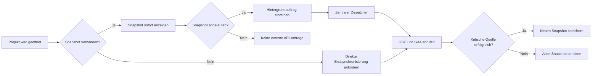

# Datenaktualisierung im DataPeak-Dashboard

Stand: 9. August 2026

Dieses Dokument beschreibt, wie DataPeak die Dashboard-Daten aus Google Search Console (GSC), Google Analytics 4 (GA4), Sitemaps und Google-Unternehmensprofilen aktualisiert. Es trennt dabei bewusst zwischen dauerhaft gespeicherten Dashboard-Snapshots, der URL-Indexierungsprüfung und den live geladenen Profilvorschauen.

## 1. Grundprinzip: Cache-first mit Stale-While-Revalidate

Ein Projektaufruf soll keine Kette externer Google-API-Anfragen auslösen. Deshalb arbeitet das Dashboard nach folgendem Prinzip:

1. DataPeak liest zuerst den letzten gespeicherten Snapshot aus Neon.
2. Ein vorhandener Snapshot wird sofort angezeigt, auch wenn er bereits zur Aktualisierung fällig ist.
3. Eine fällige Aktualisierung mit vorhandenem Snapshot wird als Hintergrundauftrag in `project_sync_jobs` eingereiht.
4. Der zentrale Dispatcher verarbeitet diese Aufträge mit begrenzter Laufzeit und begrenzter Parallelität.
5. Erst nach einem erfolgreichen Abruf wird der alte Snapshot ersetzt.
6. Bei einem kritischen GSC- oder GA4-Fehler bleibt der letzte funktionierende Snapshot erhalten.

### Zentraler Dispatcher

Vercel ruft alle zehn Minuten `GET /api/cron/sync-project-data` auf. Der Endpunkt ist mit `CRON_SECRET` geschützt und verarbeitet drei Arten von Aufträgen:

| Auftrag | Aufgabe |
| --- | --- |
| `dashboard` | Gemeinsamen Dashboard-Snapshot mit GSC-, GA4- und gegebenenfalls Google-Ads-Daten aktualisieren |
| `gsc-history` | Historische GSC-Tageswerte und gespeicherte Landingpage-Werte aktualisieren |
| `indexing` | Sitemap einlesen und ausgewählte URLs mit der URL Inspection API prüfen |

Pro Cronlauf werden maximal sechs Aufträge innerhalb eines festen Zeitbudgets verarbeitet. Die Auftragstypen rotieren, damit beispielsweise eine große Indexierungswarteschlange die normalen Dashboard-Aktualisierungen nicht verdrängt. Fehlgeschlagene Aufträge werden mit wachsendem Abstand erneut versucht und führen zu einem Fehlerstatus des Cronlaufs, damit Vercel und Monitoring den Teilausfall erkennen.

Eine 90 Sekunden lange, per Heartbeat verlängerte Projekt-Lease verhindert, dass mehrere Prozesse gleichzeitig dieselben Google-Daten abrufen. Nach einem abgebrochenen Lauf wird diese Sperre automatisch wieder frei. Kurzlebige Neon-Verbindungsfehler bei Queue-Operationen werden bis zu dreimal direkt wiederholt; bleibt der Fehler bestehen, antwortet der Dispatcher mit HTTP 503.

## 2. GSC-Daten

### Voraussetzungen

- Beim Projekt ist `gsc_site_url` hinterlegt.
- Der DataPeak-Service-Account besitzt Zugriff auf die zugehörige Search-Console-Property.

### Welche Daten werden geladen?

Der normale Dashboard-Snapshot enthält unter anderem:

- Klicks, Impressionen, CTR und durchschnittliche Position
- Tagesverlauf für den gewählten Zeitraum
- Top-Suchanfragen
- Suchanfragen je Landingpage
- aktuellen Zeitraum und einen gleich langen Vergleichszeitraum
- Prompt-Tracking-Signale aus geeigneten GSC-Queries
- offizielle Google-GenAI-Daten, soweit Google diese über die API bereitstellt; ein manueller GSC-Export bleibt sonst der Fallback

### Aktualisierungsrhythmus

Der Standardzeitraum `30d` wird automatisch als fällig markiert, sobald sein Snapshot 24 Stunden alt ist. Dieselbe zentrale Cache-Policy steuert sowohl die Anzeige als auch die Einplanung des Hintergrundauftrags:

| Zeitraum | Cache-Dauer |
| --- | ---: |
| 7 Tage | 24 Stunden |
| 30 Tage | 24 Stunden |
| 3 Monate | 48 Stunden |
| 6 Monate | 72 Stunden |
| 12, 18 und 24 Monate | 7 Tage |

Nur der aktive Standardzeitraum wird regelmäßig vorab synchronisiert. Andere Zeiträume werden nach ihrer tatsächlichen Verwendung und entsprechend ihrer längeren Cache-Dauer aktualisiert.

### GSC-Historie

Neben dem Dashboard-Snapshot gibt es einen eigenen Historienlauf:

- beim ersten Lauf werden bis zu 90 Tage geladen;
- danach wird inkrementell ein überlappendes Sieben-Tage-Fenster aktualisiert;
- der Zeitraum endet zwei Tage vor dem aktuellen Datum, weil GSC-Daten verzögert eintreffen können;
- aktuelle und vorherige 30-Tage-Werte der gespeicherten Landingpages werden aktualisiert;
- der nächste reguläre Lauf wird nach 20 Stunden geplant, bei einem Fehler nach sechs Stunden.

Die Historie liegt getrennt vom Dashboard-Snapshot in `gsc_daily_data`, `landingpages` und `project_data_sync_state`.

### Fehlerverhalten

Ist GSC für das Projekt konfiguriert und der zentrale GSC-Abruf scheitert, schreibt DataPeak keinen unvollständigen neuen Dashboard-Snapshot. Der letzte erfolgreiche Datenstand bleibt sichtbar.

## 3. GA4-Daten

### Voraussetzungen

- Beim Projekt ist `ga4_property_id` hinterlegt.
- Die verwendeten Google-Zugangsdaten dürfen auf die Property zugreifen.

### Welche Daten werden geladen?

GA4 liefert unter anderem:

- Sitzungen, Nutzer und neue Nutzer
- Conversions
- Engagement-Rate, Absprungrate und durchschnittliche Sitzungs-/Interaktionsdauer
- bezahlte Zugriffe
- KI-Traffic und KI-Traffic-Details
- Top-Landingpages und Conversion-Werte
- Channel, Land, Stadt und Endgerät
- Stadt- und Landingpage-Signale für die lokale Sichtbarkeit
- optional Google-Ads-Signale als Fallback, wenn kein Ads-Sheet konfiguriert ist

Aktueller Zeitraum und Vergleichszeitraum werden nacheinander geladen. Auch die Dimensionsberichte werden bewusst seriell abgerufen. Das reduziert gleichzeitige GA4-Anfragen und schützt vor Quota- und Concurrent-Request-Fehlern.

### Cache und Aktualisierung

GA4 und GSC werden im selben Dashboard-Snapshot in `google_data_cache` gespeichert. Deshalb gelten für GA4 dieselben Cache-Dauern wie für GSC. Das Dashboard kann beide Quellen konsistent für denselben Berichtszeitraum anzeigen, ohne beim Seitenaufruf erneut die GA4 API aufzurufen.

### Fehlerverhalten und Abdeckung

- Scheitert der zentrale GA4-Bericht, wird der bestehende Snapshot nicht überschrieben.
- Scheitert nur ein optionaler Detailbericht, kann der Snapshot mit eingeschränkter Abdeckung gespeichert werden.
- Quelle, Aktualisierungszeit, Zeitraum, Abdeckung und Berechnungsmethode werden zusätzlich in `project_metric_snapshots` dokumentiert.
- GA4-Daten bleiben von Consent, Consent Mode und gegebenenfalls modellierten Werten abhängig. Sie sind deshalb nicht direkt mit cookie-unabhängigen GSC-Impressionen gleichzusetzen.

## 4. Sitemap und Indexierungsstatus

Die Sitemap-Synchronisierung ist ein eigener Prozess. Sie ist nicht Teil des gemeinsamen GSC-/GA4-Snapshots.

### Sitemap-Erkennung

DataPeak prüft je Projekt:

1. eine explizit konfigurierte Sitemap;
2. Sitemap-Einträge aus `robots.txt`;
3. typische WordPress- und Standardpfade wie `/wp-sitemap.xml`, `/sitemap_index.xml` und `/sitemap.xml`.

Sitemap-Indizes werden rekursiv bis zu einer begrenzten Tiefe aufgelöst. Insgesamt werden maximal 5.000 URLs übernommen. URLs außerhalb der konfigurierten GSC-Property sowie technische URLs wie Feeds, Kommentar-Feeds, Trackbacks, `xmlrpc` und `wp-json` werden herausgefiltert.

### Was wird gespeichert?

| Tabelle | Inhalt |
| --- | --- |
| `project_indexing_sync` | Status und Zeitpunkt des Projektlaufs sowie nächster geplanter Lauf |
| `project_indexing_urls` | Sitemap-URL, Last-Modified-Signal, letzter bekannter Google-Status und nächster Prüftermin |
| `project_metric_snapshots` | Aggregierte Kennzahlen und Metadaten für das Widget |

Der letzte bekannte Google-Indexierungsstatus bleibt erhalten, während eine neue URL-Inspection noch aussteht. Ein massenhaft geändertes `lastmod` wird als mögliches Sitemap-Rauschen behandelt und führt nicht automatisch dazu, dass alle URLs gleichzeitig erneut geprüft werden. Neue und glaubhaft geänderte URLs werden bevorzugt.

### Automatische Prüfung

Der Dispatcher prüft pro Indexierungsauftrag maximal 80 Kandidaten mit einem Laufzeitbudget von etwa 75 Sekunden und geringer Parallelität. Reicht eine Charge nicht aus, wird die Restmenge nach etwa fünf Minuten wieder fällig und beim nächsten 10-Minuten-Dispatcherlauf automatisch fortgesetzt. Der Benutzer muss nicht wiederholt auf **Jetzt prüfen** klicken.

Das Widget unterscheidet dabei zwei Zustände:

- **Vorläufiger Datenstand:** Mindestens eine relevante Sitemap-URL hat noch kein erfolgreich klassifizierbares Inspection-Ergebnis. Indexiert-/Nicht-indexiert-Summen werden ausdrücklich als vorläufig ausgewiesen und die Erstabdeckung wird separat angezeigt.
- **Vollständiger Datenstand:** Jede relevante Sitemap-URL wurde mindestens einmal erfolgreich als indexiert oder nicht indexiert klassifiziert. Spätere zyklische Nachprüfungen ändern daran nichts; bis zum neuen Ergebnis bleibt der letzte gültige Status sichtbar.

Die ungefähren Wiederholungsintervalle sind:

| URL-Zustand | Nächste URL Inspection |
| --- | ---: |
| Indexiert und mindestens 100 GSC-Impressionen | nach 7 Tagen |
| Indexiert mit geringerer Leistung | nach 30 Tagen |
| Nicht indexiert | nach 7 Tagen |
| Noch nicht eindeutig geprüft | nach 24 Stunden |
| Fehler | abgestuft nach ca. 2, 12 oder 48 Stunden |

Ein vollständig abgeschlossener Projektlauf wird normalerweise nach 48 Stunden wieder fällig. Sofort fällige Restarbeit wird innerhalb des nächsten Dispatcher-Zyklus fortgesetzt. Liefert Google für eine URL einen temporären Fehler, wird diese URL zu ihrem abgestuften Retry-Termin erneut eingeplant, ohne den übrigen Bestand als vollständig auszugeben.

### Manuelle Prüfung

**Jetzt prüfen** startet sofort einen begrenzten Lauf mit maximal 24 aktuell fälligen URL-Inspections und einem kürzeren Laufzeitbudget. Der sichtbare Zähler bezieht sich auf die gesamte zu Beginn fällige Menge, nicht nur auf die aktuelle Charge. Verbleibende URLs werden anschließend automatisch vom Dispatcher weiterbearbeitet. Der Button setzt bewusst nicht alle bereits aktuell geprüften URLs wieder auf fällig.

### Warum können DataPeak und der GSC-Bericht abweichen?

Der GSC-Seitenbericht und die URL Inspection API sind unterschiedliche Google-Systeme und können zu verschiedenen Zeitpunkten aktualisiert werden. DataPeak zeigt den zuletzt erfolgreich geprüften URL-Status und nicht einfach die Summe aus einem exportierten GSC-Coverage-Bericht. Eine zeitweilige Differenz ist deshalb möglich und wird erst mit den nächsten URL-Inspections aufgelöst.

## 5. Google-Unternehmensprofile

### Wichtige Abgrenzung

DataPeak verwendet für die Vorschau aktuell die **Google Places API**, nicht die Google Business Profile API. Es werden daher öffentliche Profildaten angezeigt, aber keine internen Unternehmensprofil-Statistiken wie Anrufe, Routenanfragen, Nachrichten oder Beitragsleistung synchronisiert.

### Konfiguration

Die Standortkonfiguration liegt beim Projekt in `users.project_locations` und kann enthalten:

- Standortname, PLZ, Stadt und Land
- Google Place ID
- Google-Maps-/Unternehmensprofil-URL
- optionale manuelle Bild-URL
- Standort-Landingpages und Keyword-Aliase für Local SEO

### Wann werden Profildaten aktualisiert?

Unternehmensprofil-Vorschauen laufen nicht über den zentralen Cron:

1. Das Local-SEO-Widget wird angezeigt.
2. Für konfigurierte Standorte ruft der Browser `/api/google-places/preview` auf.
3. Der Server verwendet bevorzugt die Place ID; ohne verwertbare ID sucht er nach Standortname, Stadt und PLZ.
4. Zuerst wird die aktuelle Places API verwendet, bei Bedarf der Legacy-Fallback.
5. Ein erfolgreicher Stand wird projekt- und standortbezogen in Neon gespeichert und danach im Widget dargestellt.

Geladen werden insbesondere Name, Adresse, Kategorie, Bewertung, Anzahl der Bewertungen, Geschäftsstatus, aktuelle Öffnung und das erste Profilfoto.

### Cache-Verhalten

- DataPeak liest zuerst `google_place_preview_cache`. Ein bis zu 24 Stunden alter Stand wird ohne neuen Google-Abruf verwendet.
- Nach Ablauf der 24 Stunden wird das Profil beim nächsten Anzeigen erneut über Google Places geladen.
- Die Browserantwort ist eine Stunde frisch und darf bis zu 24 Stunden im Hintergrund erneuert werden (`stale-while-revalidate`).
- Profilfotos verwenden dieselbe 24-Stunden-Revalidierung.
- Eine geänderte Place ID oder Standortsuche erzeugt beim nächsten Anzeigen einen neuen Cache-Schlüssel.
- Scheitert der Google-Abruf, bleibt der letzte erfolgreiche Profilstand sichtbar und wird intern als veraltet gekennzeichnet. Ohne vorhandenen Profilstand liefert die API einen echten Fehlerstatus.
- Es wird nur der letzte erfolgreiche Stand gespeichert, kein zeitlicher Profilverlauf.

Die angezeigten Bewertungen sind reine Profildaten. Die GSC-Klicks, GA4-Nutzer und Conversions eines Standorts werden separat aus den konfigurierten Landingpages, Keyword-Aliasen und GA4-Stadtdaten berechnet.

## 6. Aktualität auf einen Blick

| Datenquelle | Automatischer Trigger | Typische Aktualität | Speicherort |
| --- | --- | --- | --- |
| GSC Dashboard | zentraler Dispatcher | Standardzeitraum etwa täglich | `google_data_cache` |
| GSC Historie | zentraler Dispatcher | etwa alle 20 Stunden, mit GSC-Verzögerung | `gsc_daily_data`, `landingpages` |
| GA4 Dashboard | gemeinsam mit Dashboard-Sync | Standardzeitraum etwa täglich | `google_data_cache` |
| Sitemap | Indexierungsauftrag | bei vollständigem Lauf etwa alle 48 Stunden | `project_indexing_urls` |
| URL Inspection | priorisierte Warteschlange | je URL 24 Stunden bis 30 Tage | `project_indexing_urls` |
| Unternehmensprofil-Vorschau | Anzeigen des Local-SEO-Widgets | projektbezogener Snapshot bis 24 Stunden, danach Revalidierung | `google_place_preview_cache` und HTTP-Cache |

## 7. Relevante Implementierungsdateien

- `vercel.json`
- `src/app/api/cron/sync-project-data/route.ts`
- `src/lib/sync/job-queue.ts`
- `src/lib/sync/dashboard.ts`
- `src/lib/sync/dashboard-snapshot.ts`
- `src/lib/sync/cache-policy.ts`
- `src/lib/sync/gsc-history.ts`
- `src/lib/indexing-status.ts`
- `src/app/api/projects/[id]/indexing-status/route.ts`
- `src/app/api/google-places/preview/route.ts`
- `src/app/api/google-places/photo/route.ts`
- `src/lib/google-place-preview-cache.ts`
- `src/lib/google-place-preview-policy.ts`
- `src/components/LocalSeoMapWidget.tsx`
